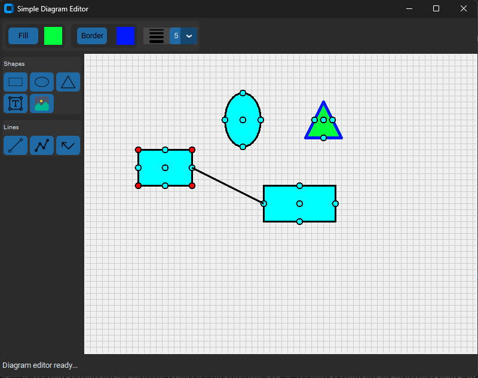

# EETools
Projects for electrical engineers and scientists on diagram editors and circuit simulators.

 - Python Quick Tutorial

### Beginner Project: Scientific Calculator

### Intermediate Projects:

#### Shape Editor

#### Line Editor

### Advanced Projects:

#### Digram Editor

#### Digital Circuit Simulator

#### Microwave Circuit Simulator

#### Analog Circuit Simulator

## Development E-Book
An eBook is included with development notes on all projects: see "EETools eBook.pdf".

